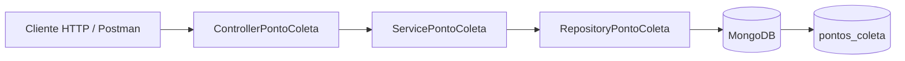
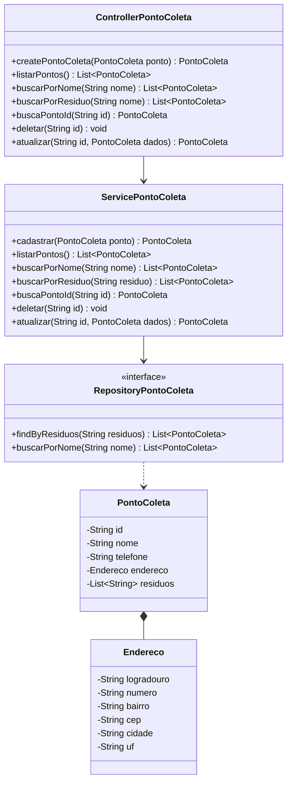
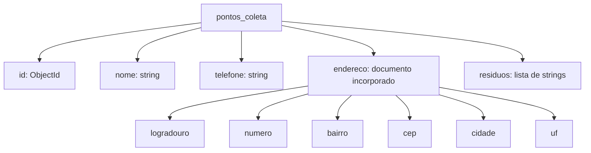

# Diagramas do EcoDescarte

Este documento registra a arquitetura atual da Prova de Conceito. Os diagramas acompanham o código existente e devem ser atualizados quando a estrutura do backend mudar.

## Arquitetura em camadas

O Controller recebe as requisições HTTP. O Service organiza os casos de uso. O Repository executa as operações na coleção `pontos_coleta` do MongoDB.

## Diagrama de classes

## Modelo do documento MongoDB

O endereço é incorporado ao documento do ponto de coleta. Portanto, não existe uma coleção separada para endereços ou resíduos nesta etapa da PoC.
